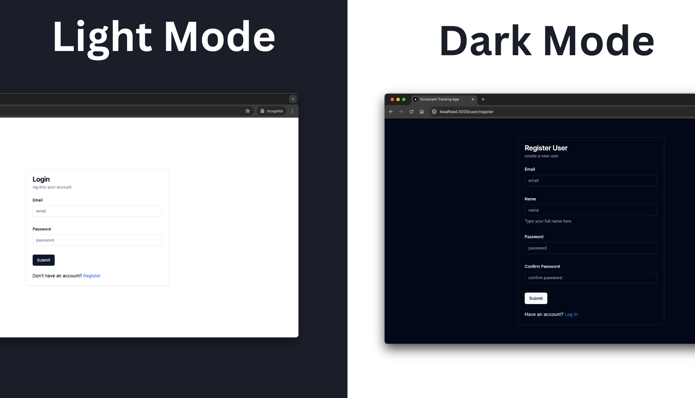
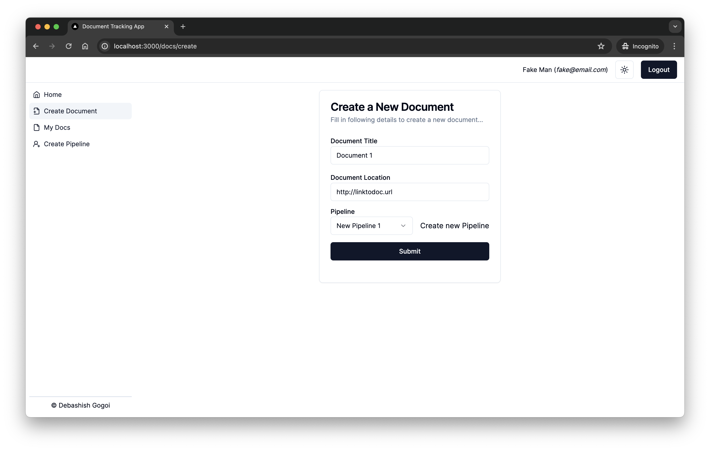
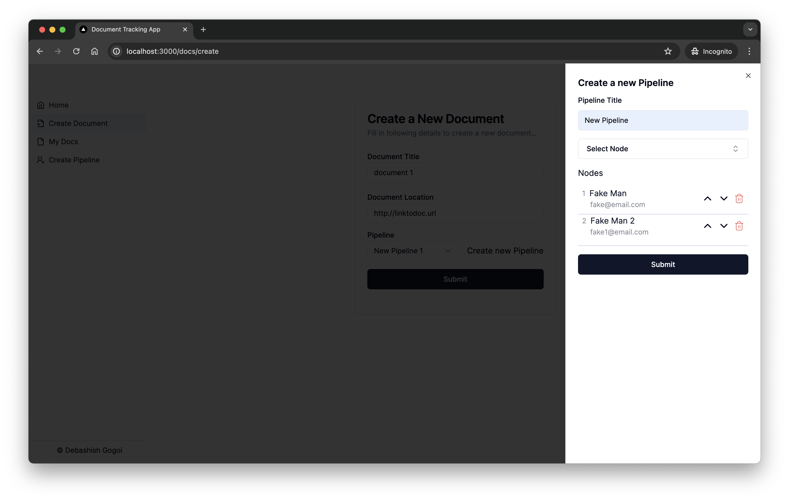
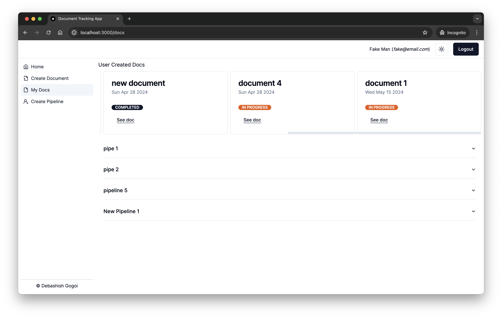
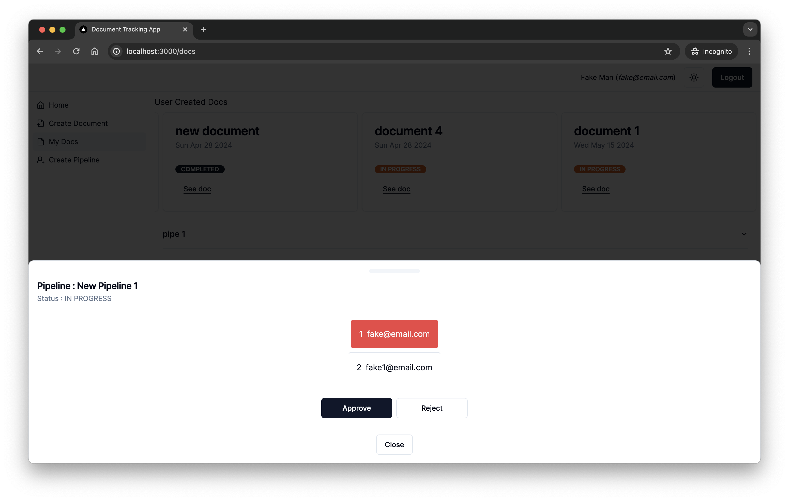

# Document Tracking Application
An application design to track document in an office/organisation.

## Demo

https://github.com/Devzard/document-tracking-app/assets/52529195/1a800754-1036-42e5-adac-b5f48c43874d








## Running Development Server

```bash
npm run dev
# or
yarn dev
# or
pnpm dev
# or
bun dev
```
Open [http://localhost:3000](http://localhost:3000) with your browser to see the result.


## Technologies used
1. Framework: Nextjs (tailwindcss, shadcnui, lucia)
2. Database: Sqlite
3. ORM: Prisma

## Project Organisation

        ├── README.md
        ├── actions
        ├── app
        │   .
        │   .
        │   └── user
        │       ├── login
        │       └── register
        ├── components
        ├── components.json
        ├── jsconfig.json
        ├── lib
        │   ├── auth.js
        │   ├── luciaPrisma.js
        │   ├── prisma.js
        │   └── utils.js
        ├── next.config.mjs
        ├── node_modules
        ├── package.json
        ├── pnpm-lock.yaml
        ├── postcss.config.js
        ├── prisma
        │   .
        │   ├── migrations
        │   └── schema.prisma
        ├── providers
        │   └── sessionProvider.js
        ├── public
        └── tailwind.config.js

